<div align="center">

<br>

<picture>
  <source media="(prefers-color-scheme: dark)" srcset="assets/banner.svg">
  <source media="(prefers-color-scheme: light)" srcset="assets/banner.svg">
  
</picture>

<br>

**Like `.env` + Homebrew for MCP servers.**

[](https://www.npmjs.com/package/owl07)
[](https://github.com/aditya-ai-architect/owl07/actions)
[](https://www.typescriptlang.org/)
[](https://opensource.org/licenses/MIT)
[](https://modelcontextprotocol.io)
[](https://nodejs.org/)

</div>

---

## The Problem

MCP configs are a mess:

- Scattered across Claude Desktop, Cursor, and Claude Code
- Global configs pollute every project with irrelevant servers
- No version control -- team members set up MCP manually
- Absolute paths break across machines
- No way to check if your servers actually work

## The Solution

One `.owl07.json` per project. Version controlled. Synced everywhere.

```bash
npx owl07 init
```

---

## Quickstart

```bash
# Initialize in your project
npx owl07 init

# Start with a template (web, python, fullstack, devops, data, minimal)
npx owl07 use fullstack

# Or add servers manually
npx owl07 add-json filesystem '{"command":"npx","args":["-y","@modelcontextprotocol/server-filesystem","${workspaceFolder}"]}'

# See what you've got
npx owl07 list

# Sync to all your AI tools
npx owl07 sync

# Health check
npx owl07 doctor
```

---

## CLI Preview

<div align="center">

</div>

The CLI features an animated owl-eyes banner that plays on startup:

```
   ╭───────╮     ╭───────╮    ██  █   █ █      ██  ████
   │       │     │       │   █  █ █   █ █     █  █    █
   │   ◉   │     │   ◉   │   █  █ █ █ █ █     █  █   █
   │       │     │       │   █  █ ██ ██ █     █  █  █
   ╰───────╯     ╰───────╯    ██   █ █  ████   ██  █

   v0.1.0 · Project-first MCP server manager
```

The eyes animate in TTY terminals -- they look around, blink, and glow. Non-TTY environments (pipes, CI) get the static version.

---

## How It Works

```
.owl07.json (in your project root)
    |
    |--- owl07 sync --->  Claude Desktop config
    |--- owl07 sync --->  Cursor .cursor/mcp.json
    |--- owl07 sync --->  Claude Code .mcp.json
```

1. Define MCP servers in `.owl07.json` (like `.eslintrc`)
2. Use workspace variables for portability (`${workspaceFolder}`, `${env:API_KEY}`)
3. Commit to git -- your whole team gets the same MCP setup
4. Run `owl07 sync` to push configs to all your AI tools
5. Run `owl07 doctor` to verify everything works

---

## Config Format

```json
{
  "$schema": "https://raw.githubusercontent.com/aditya-ai-architect/owl07/main/schema/owl07.schema.json",
  "mcpServers": {
    "filesystem": {
      "command": "npx",
      "args": ["-y", "@modelcontextprotocol/server-filesystem", "${workspaceFolder}"]
    },
    "github": {
      "command": "npx",
      "args": ["-y", "@modelcontextprotocol/server-github"],
      "env": {
        "GITHUB_TOKEN": "${env:GITHUB_TOKEN}"
      }
    }
  },
  "sync": {
    "clients": ["claude-desktop", "cursor", "claude-code"]
  }
}
```

### Workspace Variables

| Variable | Resolves To |
|----------|------------|
| `${workspaceFolder}` | Directory containing `.owl07.json` |
| `${env:VAR_NAME}` | Environment variable value |
| `${home}` | User home directory |
| `${platform}` | `win32`, `darwin`, or `linux` |

Variables stay as templates in `.owl07.json` and are resolved at sync time -- making configs portable across machines.

---

## Commands

| Command | Description |
|---------|-------------|
| `owl07 init` | Create `.owl07.json` in current project |
| `owl07 add <name>` | Add server interactively |
| `owl07 add-json <name> <json>` | Add server from JSON string |
| `owl07 remove <name>` | Remove a server |
| `owl07 list` | List all configured servers |
| `owl07 status` | Quick status overview |
| `owl07 sync` | Sync to Claude Desktop / Cursor / Claude Code |
| `owl07 sync --dry` | Preview sync without writing files |
| `owl07 doctor` | Health check all servers + system deps |
| `owl07 import` | Import from existing client configs |
| `owl07 use <template>` | Apply preset template |
| `owl07 env` | Audit environment variables referenced in config |
| `owl07 diff` | Show diff between `.owl07.json` and client configs |
| `owl07 enable <name>` | Enable a disabled server |
| `owl07 disable <name>` | Disable a server without removing it |
| `owl07 export` | Export resolved config as JSON (pipe-friendly) |

---

## Templates

Get started fast with prebuilt server bundles:

```bash
npx owl07 use web        # filesystem + GitHub + Puppeteer
npx owl07 use python     # filesystem + GitHub + memory
npx owl07 use fullstack  # filesystem + GitHub + Postgres + Puppeteer + memory
npx owl07 use devops     # filesystem + GitHub + Docker
npx owl07 use data       # filesystem + Postgres + SQLite + memory
npx owl07 use minimal    # filesystem + memory
```

Templates merge into your existing config -- they never overwrite servers you already have.

---

## Comparison

| Feature | owl07 | MCPM.sh | mcptools | MetaMCP |
|---------|-------|---------|----------|---------|
| **Project-first config** | `.owl07.json` per project | Global profiles | Global aggregation | Docker proxy |
| **Multi-client sync** | Claude Desktop + Cursor + Claude Code | Partial | No | No |
| **Git-friendly** | Workspace variables | No | No | No |
| **Zero install** | `npx owl07` | `pip install` | Go binary | Docker |
| **Health checks** | JSON-RPC ping | No | No | No |
| **Import existing** | From all clients | No | Scan only | No |
| **Templates** | 6 presets | No | No | No |

---

## Sync Targets

| Client | Config Path |
|--------|-------------|
| **Claude Desktop** | `%APPDATA%\Claude\claude_desktop_config.json` (Win) / `~/Library/Application Support/Claude/claude_desktop_config.json` (Mac) |
| **Cursor** | `.cursor/mcp.json` (project) |
| **Claude Code** | `.mcp.json` (project) |

owl07 **merges** your servers into existing configs -- it never deletes servers you added manually.

---

## Requirements

- **Node.js** >= 20.0.0
- **npm** >= 8.0.0

---

## License

MIT

---

<div align="center">

**Built by [Aditya Gaurav](https://github.com/aditya-ai-architect)**

</div>
